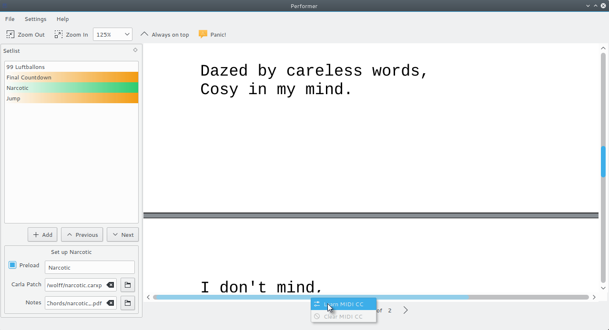
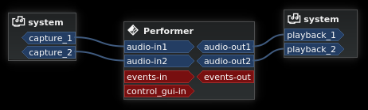
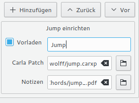

# Performer

Live performance audio session manager using [Carla](https://github.com/falktx/Carla)



[](https://travis-ci.org/progwolff/performer)

Performer lets you manage all the songs in your setlist as individual carla patches and loads each of them when you need it.
Additionally Performer uses [Okular](https://github.com/KDE/okular) or QWebEngine to display notes and chords of your songs.

## Features
* Loads carla patches for songs and connects them when they are active
* Displays notes or chords for songs
* Detects crashed instances of Carla or the Jack server and restarts them
* MIDI controllable
* Qt style selectable

## Dependencies
* Carla
* python
* qt5-base
* qt5-declarative
* qt5-tools (make)
* extra-cmake-modules (make, optional: KDE integration)
* kdebase-runtime (optional: KDE integration)
* kparts (optional: display notes or chords with okular)
* okular-git (optional: display notes or chords)
* qt5-webengine (optional: display notes or chords without okular)
* jackman (optional: automatically restart unresponsive jack server)

## Install
### Arch Linux
Install performer-git from AUR

### AV Linux / Debian Testing

A prebuilt package can be found at https://github.com/progwolff/performer/releases/download/v1.0.2/Performer-1.0.2-AVLinux.deb

To build Performer from git run:
```
$ sudo apt-get update
$ sudo apt-get install qtwebengine5-dev 
$ git clone https://github.com/progwolff/performer.git
$ cd performer
$ mkdir build && cd build
$ cmake -DCMAKE_INSTALL_PREFIX=/usr ..
$ make
$ sudo make install
```

### KXStudio / Ubuntu 14.04

A prebuilt package can be found at https://github.com/progwolff/performer/releases/download/v1.0.2/Performer-1.0.2-KXStudio.deb

This build has no document viewer enabled.

To build Performer with a document viewer on KXStudio or Ubuntu 14 run:
```
$ sudo apt-get install build-essential
$ sudo apt-get install git
$ sudo apt-get install cmake
$ sudo apt-get install libjack-jackd2-dev
$ wget http://download.qt.io/official_releases/qt/5.7/5.7.0/qt-opensource-linux-x64-5.7.0.run
$ chmod +x qt-opensource-linux-x64-5.7.0.run
$ ./qt-opensource-linux-x64-5.7.0.run
```

Install Qt to ~/Qt5.7.0, skip login, make sure to install Qt WebEngine


Build and install Performer:
```
$ git clone git@github.com:progwolff/performer.git
$ cd performer
$ mkdir build && cd build
$ cmake -DCMAKE_INSTALL_PREFIX=/usr -DCMAKE_INSTALL_DATADIR=/usr/share -DQt5_DIR=~/Qt5.7.0/5.7/gcc_64/lib/cmake/Qt5 -DJACK_LIBRARIES=/usr/lib/x86_64-linux-gnu/libjack.so -DJACK_INCLUDEDIR=/usr/include ..
$ make
$ sudo make install
```

### Other Linux Distros
```
$ mkdir build && cd build
$ cmake -DCMAKE_INSTALL_PREFIX=/usr ..
$ make
# make install
```
### Windows [Experimental]

Install Qt5 with QWebEngine.

Install Jack2

Install Carla and run it

In cmd.exe type:
```
mkdir build
cd build
cmake -CMAKE_INSTALL_BINDIR=bin -DWITH_QWEBENGINE=1 -DQt5_DIR=C:\Qt\5.8\msvc2015\lib\cmake\Qt5 -DQt5WebEngine_DIR=C:\Qt\5.8\msvc2015\lib\cmake\Qt5WebEngine -DJACK_INCLUDEDIR="C:\Program Files (x86)\Jack\includes" -DJACK_LIBRARIES="C:\Program Files (x86)\Jack\lib\libjack.lib" -G"Visual Studio 14 2015" ..
cmake --build . --config Release --target package
```

Use the generated installer to install Performer

### Android [Experimental]

```
mkdir build
cd build
cmake -DCMAKE_TOOLCHAIN_FILE=${ANDROID_NDK}/build/cmake/android.toolchain.cmake -DANDROID_TOOLCHAIN_ROOT=arm-linux-androideabi -DANDROID_ABI="armeabi-v7a" -DCMAKE_FIND_ROOT_PATH="/opt/android-qt5;/opt/android-qt5/5.7.0/armeabi-v7a/lib/cmake/Qt5" -DANDROID_TOOLCHAIN_NAME=arm-linux-androideabi-4.9 -DANDROID_TOOLCHAIN_MACHINE_NAME=arm-linux-androideabi -DANDROID_COMPILER_VERSION=4.9 -DWITH_JACK=0 ..
cmake --build .
```

Install the apk in src/bin/ to your android device.

## Usage
Start Performer.

Using command line tools or a jack patchbay like [Catia](http://kxstudio.linuxaudio.org/Applications:Catia) connect the ports of Performer to the appropriate system ports or to the ports of other jack clients.



The Carla instances created by Performer will connect to the same ports Performer is connected to. 

Connect the events-in port to a MIDI input device. Ports connected to events-in will act as MIDI input for Carla instances created by Performer. 

Connect the control_gui-in port to a MIDI input device that you want to use to control the GUI of Performer.

Click the "Add" button. Change the name of the song to the name of a song you want to have in your setlist. Add a Carla patch file (.carxp) for this song. Add notes or chords (.pdf, .txt, .png, ...) for this song. They will be displayed when the song is active or when you click on it's entry in the setlist.



Right click the song's entry in the setlist. Choose "Play now". If you assigned a Carla patch to this song, a new instance of Carla will be created, loading the patch file. It's ports will be connected to the same ports Performer is connected to, allowing you to play this song.

Add some more songs to your setlist. 

Save the setlist (File -> Save).

Click "Next". A Carla instance for the next song in your setlist will be created. The Carla instances of the previous and of the next song are still preloaded, allowing you to quickly switch to one of these songs, but only the active song is connected to your system ports.

Right click a GUI element like the "Next" button or the document viewer's scrollbar. In the shown MIDI learn context menu choose "Learn MIDI CC". Move a control of a MIDI device connected to the control_gui-in port. This control will be 
assigned to the GUI element, allowing you to control Performer's GUI with your MIDI device.
